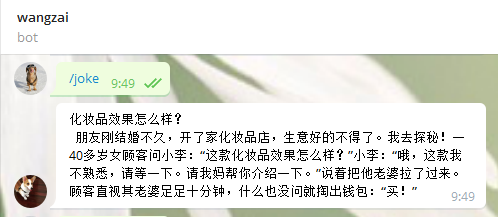

# wangzai_bot
> I am wangzai bot.  


## requirement

```sh

# pyenv
curl -L https://raw.githubusercontent.com/yyuu/pyenv-installer/master/bin/pyenv-installer | bash

# virturlenv
pip install virturlenv

# telegram-lib
pip install python-telegram-bot

# 使用代理连接telegram所需
pip install urllib3[socks]

# 调用http协议所需
pip install requests

# 图像识别：还需要安装tesseract-ocr
pip install pytesseract

# 加密算法
pip install cryptography

```

> 安装tesseract-ocr并配置环境变量:
1. [下载](https://github.com/UB-Mannheim/tesseract/wiki)
1. ```path```中增加```C:\Program Files (x86)\Tesseract-OCR```
2. 增加```TESSDATA_PREFIX```变量```C:\Program Files (x86)\Tesseract-OCR\tessdata```
